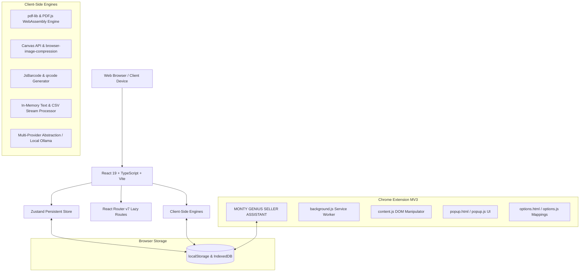

# ARCHITECTURE & SYSTEM DESIGN

# MONTY GENIUS ECOM TOOLS
> Free Tools for Smart Online Sellers  
> Designed with ❤️ by Mr. Monty Genius

---

## 1. Executive Overview

**MONTY GENIUS ECOM TOOLS** is an autonomous, open-source, privacy-first web application suite and Chrome extension specifically engineered for e-commerce sellers. It delivers 40+ professional-grade calculators, PDF document manipulation tools, image compressors, barcode/QR generators, invoice creators, and autofill automation tools without requiring paid SaaS subscriptions, cloud database backends, or third-party paid APIs.

---

## 2. System Architecture



---

## 3. Technology Stack

| Layer | Technology | Rationale |
|---|---|---|
| **Framework** | React 19 + TypeScript | Type-safe, concurrent rendering, modular functional architecture |
| **Build Tool** | Vite 8 + @tailwindcss/vite | Sub-second HMR, optimized Rollup bundling, dynamic chunk code-splitting |
| **Styling** | Tailwind CSS v4 | SaaS modern aesthetics, glassmorphism, responsive mobile-first dark/light theme |
| **Icons** | Lucide React | Clean, consistent, lightweight vector iconography |
| **State** | Zustand 5 (`persist` middleware) | Lightweight state management with zero boilerplate and automatic localStorage syncing |
| **PDF Processing** | `pdf-lib` + `pdfjs-dist` | In-browser PDF loading, cropping, merging, splitting, embedding, and N-up rendering |
| **Image Processing** | HTML5 Canvas API + `browser-image-compression` | Direct browser-based raster manipulation, resizing, format conversion, and compression |
| **Packaging & Export** | `JSZip` + `file-saver` | In-memory ZIP compilation and client-side binary blob download |
| **Barcodes & QR** | `JsBarcode` + `qrcode` | Vector SVG and raster PNG rendering with checksum validation |
| **Chrome Extension** | Manifest V3 | Secure service worker lifecycle, declarative scripting, sandboxed storage |

---

## 4. Code Splitting & Performance Strategy

Every individual tool is imported using `React.lazy()` with dynamic `import()` chunks. This prevents heavy PDF or graphing libraries from blocking the homepage first contentful paint (FCP):

- **Homepage Bundle:** ~18.9 kB JS (5.7 kB gzipped)
- **Heavy PDF Chunks (`pdf-lib`, `pdfjs-dist`):** Lazy-loaded on-demand only when a user navigates to `/tools/pdf-*`
- **Heavy Graph Chunks (`recharts`):** Lazy-loaded only on calculator pages
- **Offline PWA:** Service worker caches critical app shell resources and responds offline seamlessly.

---

## 5. Storage Architecture

All persistent user configuration utilizes local browser APIs:
- `monty-genius-app-storage`: Stores theme mode (`dark` / `light` / `system`), saved favorites array, and recent tools timestamps.
- `mg_invoice_template`: Stores seller GSTIN, registered business name, and address defaults for 1-click invoice creation.
- `mg_ai_key` & `mg_ai_provider`: Stores user-configured OpenAI, Gemini, or OpenRouter keys (or Ollama endpoint) inside local browser storage.
- Chrome Extension Storage (`chrome.storage.local`): Stores custom CSS selector mappings and saved product catalogs.

---

## 6. Directory Structure

```
MONTY GENIUS ECOM TOOLS/
├── frontend/
│   ├── public/             # Static assets, PWA manifest, service worker, robots, sitemap
│   ├── src/
│   │   ├── components/     # UI primitives (Button, Card, Input, Modal, Select, ResultCard)
│   │   ├── data/           # Tool definitions, categorization, search index
│   │   ├── hooks/          # Keyboard shortcuts (Ctrl+K), theme hooks
│   │   ├── pages/          # Home, AllTools, Category, About, Privacy, DevTestSuite
│   │   │   └── tools/      # Individual modular tool implementations
│   │   ├── store/          # Zustand application state
│   │   ├── types/          # TypeScript interfaces
│   │   └── utils/          # Download, formatting, storage helpers
│   ├── package.json
│   ├── tsconfig.app.json
│   └── vite.config.ts
├── extension/              # Manifest V3 Chrome Extension
│   ├── manifest.json
│   ├── background.js
│   ├── content.js
│   ├── popup.html / popup.js / popup.css
│   ├── options.html / options.js
│   └── icons/
├── tests/                  # Deterministic unit test suites
│   ├── calculators.test.js
│   ├── seller_utilities.test.js
│   └── run_all_tests.js
├── docs/                   # Architectural & technical documentation
└── README.md
```
