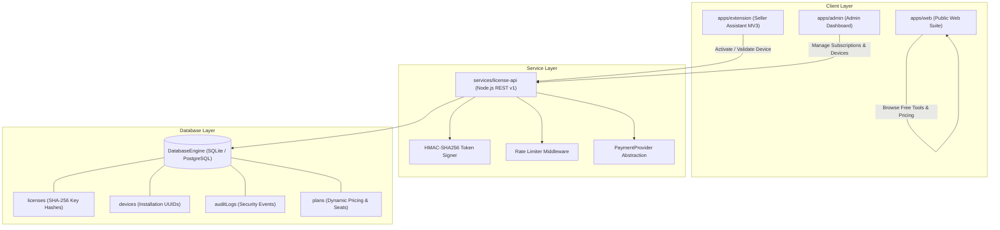

# ARCHITECTURE & SYSTEM DESIGN — COMMERCIAL EDITION

# MONTY GENIUS ECOM TOOLS
> Free Tools for Smart Online Sellers  
> Designed with ❤️ by Mr. Monty Genius  

---

## 1. Commercial Monorepo Architecture

The platform is structured as an npm workspaces monorepo:

```text
monty-genius-ecom-tools/
├── apps/
│   ├── web/               # Public SaaS & Free Toolset (React 19 + Vite + Tailwind v4)
│   ├── extension/         # MONTY GENIUS SELLER ASSISTANT (Manifest V3 Chrome Extension)
│   └── admin/             # Commercial Administration Portal (React + Vite + Tailwind)
├── services/
│   └── license-api/       # Central Licensing, Device Limits, and Payment Webhook API
├── packages/
│   ├── shared-types/      # TypeScript definitions for Users, Plans, Licenses, Devices
│   ├── config/            # Central Plans, Feature Flags, and Version Configuration
│   ├── calculator-engine/ # Pure mathematical business calculations
│   ├── validation/        # License key, device identifier, and schema validators
│   └── ui/                # Shared theme constants and design helpers
├── docs/                  # Comprehensive technical documentation
├── tests/                 # Automated unit, integration, and security test suites
├── scripts/               # Extension packaging and deployment automation
└── README.md
```

---

## 2. High-Level System Architecture Diagram



---

## 3. Technology Stack

| Component | Technology | Rationale |
|---|---|---|
| **Public Web App (`apps/web`)** | React 19 + TypeScript + Vite | Blazing fast client-side performance, code-split lazy routes, zero server file upload |
| **Seller Assistant (`apps/extension`)** | Chrome Extension Manifest V3 | Modular architecture, generic autofill engine with Meesho/Amazon/Flipkart adapters |
| **Admin Control (`apps/admin`)** | React 19 + Tailwind v4 + Vite | Secure server-side authenticated control portal with real database analytics |
| **License API (`services/license-api`)** | Node.js REST v1 + HMAC Signer | Cryptographic key hashing (`MGPRO-`), device seat limits, rate limiting, audit logging |
| **Database** | ACID Relational Storage Engine | Atomic writes, transaction safety, zero external driver friction, PostgreSQL ready |
| **Shared Packages** | TypeScript Workspaces | DRY code sharing between web, extension, admin, and backend services |

---

## 4. Key Design Principles

1. **Owner Free Mode:** In development mode (`APP_ENV=development` / `LICENSE_REQUIRED=false`), the owner has full unlocked access across all tools and the extension without payment.
2. **Zero Plaintext Secrets:** License keys are stored exclusively as cryptographic SHA-256 hashes.
3. **No Invasive Surveillance:** Device identifiers are privacy-conscious installation tokens (`dev_...`) without collecting MAC addresses or hardware serials.
4. **Offline Resilience:** The extension caches signed HMAC-SHA256 authorization tokens with a 72-hour grace period, ensuring sellers are never stranded during internet downtime.
5. **No Vendor Lock-In:** Core calculation algorithms and in-browser PDF/image processors operate client-side without cloud API reliance.
